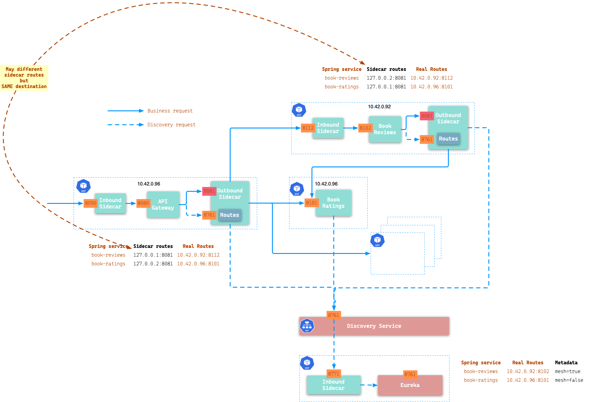
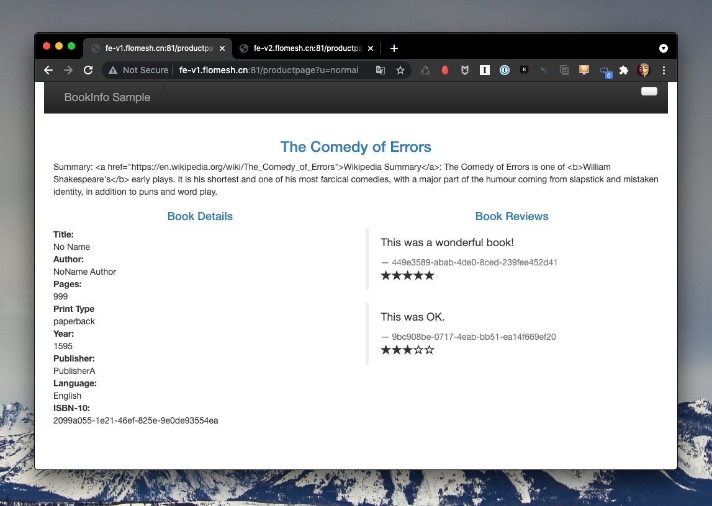
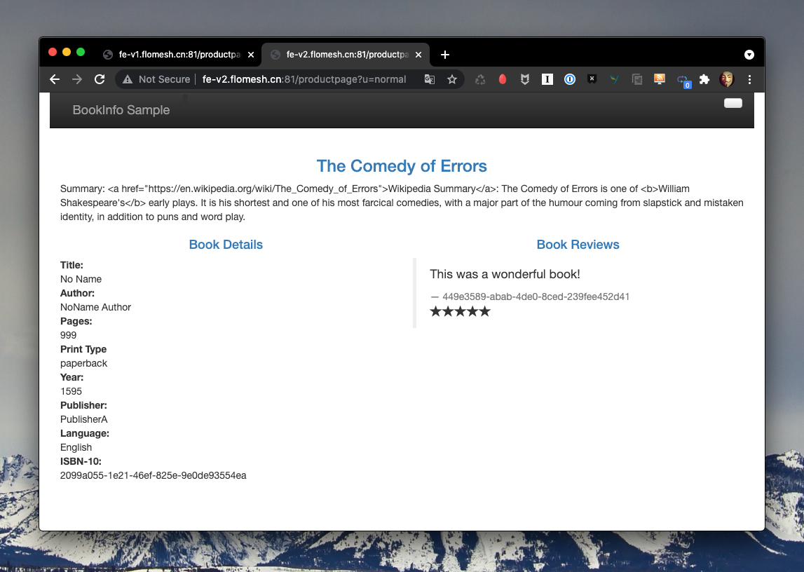

# Spring Bookinfo Demo Quickstart

## Architect


## Environment Setup

Install [k3s](https://github.com/k3s-io/k3s) via [k3d](https://k3d.io/). It will run k3s in Docker. So Docker is required.

```shell
k3d cluster create spring-demo -p "81:80@loadbalancer" --k3s-server-arg '--no-deploy=traefik'
```

## Flomesh Installation

Clone code from `https://github.com/addozhang/flomesh-bookinfo-demo.git`. Then go into directory `flomesh-bookinfo-demo/kubernetes`.

All manifests are located in that directory including YAMLs of Flomesh components and demo.

### Install Cert Manager

```shell
$ kubectl apply -f artifacts/cert-manager-v1.3.1.yaml
customresourcedefinition.apiextensions.k8s.io/certificaterequests.cert-manager.io created
customresourcedefinition.apiextensions.k8s.io/certificates.cert-manager.io created
customresourcedefinition.apiextensions.k8s.io/challenges.acme.cert-manager.io created
customresourcedefinition.apiextensions.k8s.io/clusterissuers.cert-manager.io created
customresourcedefinition.apiextensions.k8s.io/issuers.cert-manager.io created
customresourcedefinition.apiextensions.k8s.io/orders.acme.cert-manager.io created
namespace/cert-manager created
serviceaccount/cert-manager-cainjector created
serviceaccount/cert-manager created
serviceaccount/cert-manager-webhook created
clusterrole.rbac.authorization.k8s.io/cert-manager-cainjector created
clusterrole.rbac.authorization.k8s.io/cert-manager-controller-issuers created
clusterrole.rbac.authorization.k8s.io/cert-manager-controller-clusterissuers created
clusterrole.rbac.authorization.k8s.io/cert-manager-controller-certificates created
clusterrole.rbac.authorization.k8s.io/cert-manager-controller-orders created
clusterrole.rbac.authorization.k8s.io/cert-manager-controller-challenges created
clusterrole.rbac.authorization.k8s.io/cert-manager-controller-ingress-shim created
clusterrole.rbac.authorization.k8s.io/cert-manager-view created
clusterrole.rbac.authorization.k8s.io/cert-manager-edit created
clusterrole.rbac.authorization.k8s.io/cert-manager-controller-approve:cert-manager-io created
clusterrole.rbac.authorization.k8s.io/cert-manager-webhook:subjectaccessreviews created
clusterrolebinding.rbac.authorization.k8s.io/cert-manager-cainjector created
clusterrolebinding.rbac.authorization.k8s.io/cert-manager-controller-issuers created
clusterrolebinding.rbac.authorization.k8s.io/cert-manager-controller-clusterissuers created
clusterrolebinding.rbac.authorization.k8s.io/cert-manager-controller-certificates created
clusterrolebinding.rbac.authorization.k8s.io/cert-manager-controller-orders created
clusterrolebinding.rbac.authorization.k8s.io/cert-manager-controller-challenges created
clusterrolebinding.rbac.authorization.k8s.io/cert-manager-controller-ingress-shim created
clusterrolebinding.rbac.authorization.k8s.io/cert-manager-controller-approve:cert-manager-io created
clusterrolebinding.rbac.authorization.k8s.io/cert-manager-webhook:subjectaccessreviews created
role.rbac.authorization.k8s.io/cert-manager-cainjector:leaderelection created
role.rbac.authorization.k8s.io/cert-manager:leaderelection created
role.rbac.authorization.k8s.io/cert-manager-webhook:dynamic-serving created
rolebinding.rbac.authorization.k8s.io/cert-manager-cainjector:leaderelection created
rolebinding.rbac.authorization.k8s.io/cert-manager:leaderelection created
rolebinding.rbac.authorization.k8s.io/cert-manager-webhook:dynamic-serving created
service/cert-manager created
service/cert-manager-webhook created
deployment.apps/cert-manager-cainjector created
deployment.apps/cert-manager created
deployment.apps/cert-manager-webhook created
mutatingwebhookconfiguration.admissionregistration.k8s.io/cert-manager-webhook created
validatingwebhookconfiguration.admissionregistration.k8s.io/cert-manager-webhook created
```

Note: wait for all pods up in namespace `cert-manager`：

```shell
$ kubectl get pod -n cert-manager
NAME                                       READY   STATUS    RESTARTS   AGE
cert-manager-webhook-56fdcbb848-q7fn5      1/1     Running   0          98s
cert-manager-59f6c76f4b-z5lgf              1/1     Running   0          98s
cert-manager-cainjector-59f76f7fff-flrr7   1/1     Running   0          98s
```

### Install Operator

```shell
$ kubectl apply -f artifacts/pipy-operator.yaml
```

You should get output like below:

```
namespace/flomesh created
customresourcedefinition.apiextensions.k8s.io/proxies.flomesh.io created
customresourcedefinition.apiextensions.k8s.io/proxyprofiles.flomesh.io created
serviceaccount/operator-manager created
role.rbac.authorization.k8s.io/leader-election-role created
clusterrole.rbac.authorization.k8s.io/manager-role created
clusterrole.rbac.authorization.k8s.io/metrics-reader created
clusterrole.rbac.authorization.k8s.io/proxy-role created
rolebinding.rbac.authorization.k8s.io/leader-election-rolebinding created
clusterrolebinding.rbac.authorization.k8s.io/manager-rolebinding created
clusterrolebinding.rbac.authorization.k8s.io/proxy-rolebinding created
configmap/manager-config created
service/operator-manager-metrics-service created
service/proxy-injector-svc created
service/webhook-service created
deployment.apps/operator-manager created
deployment.apps/proxy-injector created
certificate.cert-manager.io/serving-cert created
issuer.cert-manager.io/selfsigned-issuer created
mutatingwebhookconfiguration.admissionregistration.k8s.io/mutating-webhook-configuration created
mutatingwebhookconfiguration.admissionregistration.k8s.io/proxy-injector-webhook-cfg created
validatingwebhookconfiguration.admissionregistration.k8s.io/validating-webhook-configuration created
```

Note: make sure all pods up in namespace `flomesh`:

```shell
$ kubectl get pod -n flomesh
NAME                               READY   STATUS    RESTARTS   AGE
proxy-injector-5bccc96595-spl6h    1/1     Running   0          39s
operator-manager-c78bf8d5f-wqgb4   1/1     Running   0          39s
```

### Install Ingress Controller

```shell
$ kubectl apply -f ingress/ingress-pipy.yaml
namespace/ingress-pipy created
customresourcedefinition.apiextensions.k8s.io/ingressparameters.flomesh.io created
serviceaccount/ingress-pipy created
role.rbac.authorization.k8s.io/ingress-pipy-leader-election-role created
clusterrole.rbac.authorization.k8s.io/ingress-pipy-role created
rolebinding.rbac.authorization.k8s.io/ingress-pipy-leader-election-rolebinding created
clusterrolebinding.rbac.authorization.k8s.io/ingress-pipy-rolebinding created
configmap/ingress-config created
service/ingress-pipy-cfg created
service/ingress-pipy-controller created
service/ingress-pipy-defaultbackend created
service/webhook-service created
deployment.apps/ingress-pipy-cfg created
deployment.apps/ingress-pipy-controller created
deployment.apps/ingress-pipy-manager created
certificate.cert-manager.io/serving-cert created
issuer.cert-manager.io/selfsigned-issuer created
mutatingwebhookconfiguration.admissionregistration.k8s.io/mutating-webhook-configuration configured
validatingwebhookconfiguration.admissionregistration.k8s.io/validating-webhook-configuration configured
```

Check the pod status in namespace `ingress-pipy`:

```shell
kubectl get pod -n ingress-pipy
NAME                                       READY   STATUS    RESTARTS   AGE
svclb-ingress-pipy-controller-8pk8k        1/1     Running   0          71s
ingress-pipy-cfg-6bc649cfc7-8njk7          1/1     Running   0          71s
ingress-pipy-controller-76cd866d78-m7gfp   1/1     Running   0          71s
ingress-pipy-manager-5f568ff988-tw5w6      0/1     Running   0          70s
```

Now, you already have Flomesh installed, including operator and ingress controller.

## Middleware

### Use Pipy to mock

### Run with Docker

```yaml
version: "3"
services:
  server:
    container_name: clickhouse-server
    image: yandex/clickhouse-server
    ports:
      - "8123:8123"
      - "9000:9000"
      - "9009:9009"

    ulimits:
      nproc: 65535
      nofile:
        soft: 262144
        hard: 262144
  client:
    container_name: clickhouse-client
    image: yandex/clickhouse-client
    command: ["--host", "server"]
    depends_on:
      - server
```

## Run Demo

The demo is running a separated namespace `flomesh-spring`, execute `kubectl apply -f base/namespace.yaml` to create. If you describe the created namespace, you will find it annotated with `flomesh.io/inject=true`.

This annotation indicates Admission WebHook of operator to hook the pod creation of this annotated namespace.

```shell
$ kubectl describe ns flomesh-spring
Name:         flomesh-spring
Labels:       app.kubernetes.io/name=spring-mesh
              app.kubernetes.io/version=1.19.0
              flomesh.io/inject=true
              kubernetes.io/metadata.name=flomesh-spring
Annotations:  <none>
Status:       Active

No resource quota.

No LimitRange resource.
```

First of all, let's go through the `ProxyProfile` CRD provided by operator. In this demo, it describes the proxy sidecar container fragment and the script used by proxy. Check [proxy-profile.yaml]() for more details.

```shell
$ kubectl apply -f sidecar/proxy-profile.yaml
```

Check if it's created successfully:

```shell
$ kubectl get pf
NAME                         SELECTOR                                                    CONFIG                                                                AGE
proxy-profile-002-bookinfo   {"matchLabels":{"sys":"bookinfo-samples","version":"v1"}}   {"flomesh-spring":"proxy-profile-002-bookinfo-fsmcm-b67a9e39-23a1"}   40s
```

Then, you need to have ClickHouse installed somewhere, and create the log table by [init-log.sql](scripts/init-log.sql) in default schema:

```sql
create table log (
    rid UInt64 default JSONExtractInt(message,'rid'),
    sid UInt64 default JSONExtractInt(message,'sid'),
    iid String default JSONExtractString(message,'iid'),
    dir String default JSONExtractString(message,'dir'),
    proto String default JSONExtractString(message,'proto'),
    req String default JSONExtractRaw(message,'req'),
    `req.id` String default JSONExtractString(req,'id'),
    `req.protocol` String default JSONExtractString(req,'protocol'),
    `req.version` String default JSONExtractString(req,'version'),
    `req.service.name` String default JSONExtractString(req,'service.name'),
    `req.service.version` String default JSONExtractString(req,'service.version'),
    `req.method.name` String default JSONExtractString(req,'method.name'),
    `req.method.type` String default JSONExtractString(req,'method.type'),
    `req.method` String default JSONExtractString(req,'method'),
    `req.path` String default JSONExtractString(req,'path'),
    `req.headers` String default JSONExtractRaw(req,'headers'),
    `req.body` String default JSONExtractString(req,'body'),
    `req.arguments` Array(String) default JSONExtractArrayRaw(req,'arguments'),
    res String default JSONExtractRaw(message,'res'),
    `res.protocol` String default JSONExtractString(res,'protocol'),
    `res.type` Int32 default JSONExtractInt(res,'type'),
    `res.value` String default JSONExtractString(res,'value'),
    `res.status` UInt32 default JSONExtractInt(res,'status'),
    `res.statusText` String default JSONExtractString(res,'statusText'),
    `res.headers` String default JSONExtractRaw(res,'headers'),
    `res.body` String default JSONExtractString(res,'body'),
    reqTime UInt64 default JSONExtractInt(message,'reqTime'),
    resTime UInt64 default JSONExtractInt(message,'resTime'),
    reqSize UInt64 default JSONExtractInt(message,'reqSize'),
    resSize UInt64 default JSONExtractInt(message,'resSize'),
    localAddr String default JSONExtractString(message, 'localAddr'),
    localPort UInt32 default JSONExtractInt(message, 'localPort'),
    remoteAddr String default JSONExtractString(message, 'remoteAddr'),
    remotePort UInt32 default JSONExtractInt(message, 'remotePort'),
    node String default JSONExtractRaw(message,'node'),
    `node.ip` String default JSONExtractString(node,'ip'),
    `node.name` String default JSONExtractString(node,'name'),
    pod String default JSONExtractRaw(message,'pod'),
    `pod.ns` String default JSONExtractString(pod,'ns'),
    `pod.ip` String default JSONExtractString(pod,'ip'),
    `pod.name` String default JSONExtractString(pod,'name'),
    service String default JSONExtractRaw(message,'service'),
    `service.name` String default JSONExtractString(service,'name'),
    target String default JSONExtractRaw(message,'target'),
    `target.address` String default JSONExtractString(target,'address'),
    `target.port` UInt32 default JSONExtractInt(target,'port'),
    trace String default JSONExtractRaw(message,'trace'),
    `trace.id` String default JSONExtractString(trace,'id'),
    `trace.span` String default JSONExtractString(trace,'span'),
    `trace.parent` String default JSONExtractString(trace,'parent'),
    `trace.sampled` String default JSONExtractString(trace,'sampled'),
    `env` String DEFAULT JSONExtractRaw(message, 'env'),
    id UUID default generateUUIDv4(),
    targetId UUID,
    timestamp DateTime default now(),
    message String
) engine=MergeTree()
partition by toYYYYMM(toDateTime(reqTime/1000))
order by reqTime;
```

As the services has startup dependencies, you need to deploy it one by one following the strict order. Before starting, check the **Endpoints** section of **base/clickhouse.yaml**.

```yaml
apiVersion: v1
kind: Endpoints
metadata:
  name: samples-clickhouse
  namespace: flomesh-spring
  labels:
    app: clickhouse
    service: clickhouse
subsets:
  - addresses:
    - ip: 172.19.182.213 // replace IP here
    ports:
    - name: chdb
      port: 8123
      protocol: TCP
```

After above, execute `kubectl apply -f base/clickhouse.yaml`.

### Deploy Discovery Server

```shell
$ kubectl apply -f base/discovery-server.yaml
```

Check pod status and make sure there are two containers ready.

```shell
$ kubectl get pod
NAME                                           READY   STATUS        RESTARTS   AGE
samples-discovery-server-v1-85798c47d4-dr72k   2/2     Running       0          96s
```

### Deploy Config Server

```shell
$ kubectl apply -f base/config-service.yaml
```

### Deploy API Gateway and other Apps

```shell
$ kubectl apply -f base/bookinfo-v1.yaml
$ kubectl apply -f base/bookinfo-v2.yaml
$ kubectl apply -f base/productpage-v1.yaml
$ kubectl apply -f base/productpage-v2.yaml
```

Then check pods status, all pods except config service have sidecar container injected.

```shell
$ kubectl get pods
samples-discovery-server-v1-85798c47d4-p6zpb       3/3     Running   0          19h
samples-config-service-v1-84888bfb5b-8bcw9         1/1     Running   0          19h
samples-api-gateway-v1-75bb6456d6-nt2nl            3/3     Running   0          6h43m
samples-bookinfo-ratings-v1-6d557dd894-cbrv7       3/3     Running   0          6h43m
samples-bookinfo-details-v1-756bb89448-dxk66       3/3     Running   0          6h43m
samples-bookinfo-reviews-v1-7778cdb45b-pbknp       3/3     Running   0          6h43m
samples-api-gateway-v2-7ddb5d7fd9-8jgms            3/3     Running   0          6h37m
samples-bookinfo-ratings-v2-845d95fb7-txcxs        3/3     Running   0          6h37m
samples-bookinfo-reviews-v2-79b4c67b77-ddkm2       3/3     Running   0          6h37m
samples-bookinfo-details-v2-7dfb4d7c-jfq4j         3/3     Running   0          6h37m
samples-bookinfo-productpage-v1-854675b56-8n2xd    1/1     Running   0          7m1s
samples-bookinfo-productpage-v2-669bd8d9c7-8wxsf   1/1     Running   0          6m57s
```

### Before Test

The access to sample is via Ingress controller. First we need to obtain the ip address of LB.

```shell
//Obtain the controller IP
//Here, we append port. 
ingressAddr=`kubectl get svc ingress-pipy-controller -n ingress-pipy -o jsonpath='{.spec.clusterIP}'`:81
```

We run all apps in k3s cluster which created by `k3d` with option `-p 81:80@loadbalancer`, the cluster runs in a Docker container. So we can use ip `127.0.0.1` and port `81`.

Due to principle of Ingress, we arrange host names for each `rule`. Each request sending to ingress controller should carry host above in HTTP header `Host`.

Or you can add entries in `/etc/hosts`.

```shell
$ kubectl get ing ingress-pipy-bookinfo -n flomesh-spring -o jsonpath="{range .spec.rules[*]}{.host}{'\n'}"
api-v1.flomesh.cn
api-v2.flomesh.cn
fe-v1.flomesh.cn
fe-v2.flomesh.cn

//run with sudo, or add manually
$ echo 127.0.0.1 api-v1.flomesh.cnapi-v2.flomesh.cnfe-v1.flomesh.cnfe-v2.flomesh.cn >> /etc/hosts
```


#### Verification

```shell
$ curl http://127.0.0.1:81/actuator/health -H 'Host: api-v1.flomesh.cn'
{"status":"UP","groups":["liveness","readiness"]}
//OR
$ curl http://api-v1.flomesh.cn:81/actuator/health
{"status":"UP","groups":["liveness","readiness"]}
```

## Test

```shell
# rate a book
$ curl -X POST http://$ingressAddr/bookinfo-ratings/ratings \
	-H "Content-Type: application/json" \
	-H "Host: api-v1.flomesh.cn" \
	-d '{"reviewerId":"9bc908be-0717-4eab-bb51-ea14f669ef20","productId":"2099a055-1e21-46ef-825e-9e0de93554ea","rating":3}' 

$ curl http://$ingressAddr/bookinfo-ratings/ratings/2099a055-1e21-46ef-825e-9e0de93554ea -H "Host: api-v1.flomesh.cn"

# review a book
$ curl -X POST http://$ingressAddr/bookinfo-reviews/reviews \
	-H "Content-Type: application/json" \
	-H "Host: api-v1.flomesh.cn" \
	-d '{"reviewerId":"9bc908be-0717-4eab-bb51-ea14f669ef20","productId":"2099a055-1e21-46ef-825e-9e0de93554ea","review":"This was OK.","rating":3}'

$ curl http://$ingressAddr/bookinfo-reviews/reviews/2099a055-1e21-46ef-825e-9e0de93554ea -H "Host: api-v1.flomesh.cn"
```

After execute commands above, we can access the two version product page and get result as below.




