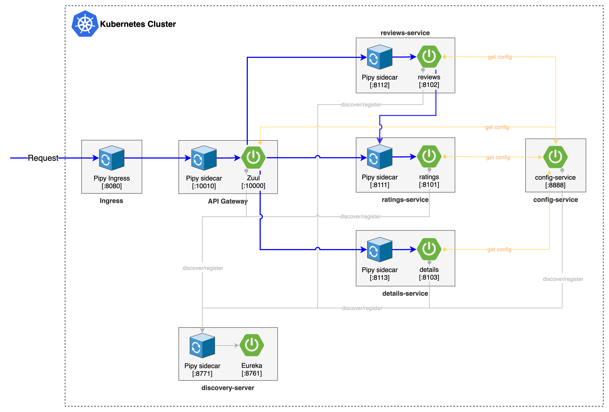

# Topology


# Build

* For config-service, discovery-server, api-gateway, ratings, reviews, details, use mvn to build that
~~~~~bash
mvn clean package
~~~~~
It will generate Spring Boot fat *jar* file in each dir targets subdir

* For productpage, it's written in python, no need to build

Then run the following command to build docker images:
```bash
./docker-build-push.sh 
```


# Deploy to Kubernetes/K3s & Test

## Deploy pipy-operator
Check out [pipy-operator](https://github.com/flomesh-io/pipy-operator) code, enter the root folder of this project.
* Install Cert Manager v1.1.0
  > `kubectl apply -f etc/cert-manager-v1.1.0.yaml`

	Wait for the pods in **cert-manager** namespace are all running.
	```shell
	[root@crd ~]# kubectl get pods -A
	NAMESPACE      NAME                                      READY   STATUS      RESTARTS   AGE
	kube-system    helm-install-traefik-s77bg                0/1     Completed   5          9h
	kube-system    metrics-server-86cbb8457f-d6hk2           1/1     Running     6          9h
	kube-system    local-path-provisioner-7c458769fb-9ksqq   1/1     Running     7          9h
	kube-system    svclb-traefik-8pb9c                       2/2     Running     4          9h
	kube-system    coredns-854c77959c-gk9p8                  1/1     Running     2          9h
	kube-system    traefik-6f9cbd9bd4-842d7                  1/1     Running     2          9h
	cert-manager   cert-manager-6865f45f85-7gjcb             1/1     Running     0          9h
	cert-manager   cert-manager-cainjector-fdbc9f44-8xv27    1/1     Running     0          9h
	cert-manager   cert-manager-webhook-5d59497545-vdchs     1/1     Running     0          9h
	```
* Install Operator
	`kubectl apply -f artifact/pipy-operator.yaml`

 	You should see the output like this：
	```shell
	[root@crd pipy-operator]# kubectl apply -f artifact/pipy-operator.yaml
	Warning: apiextensions.k8s.io/v1beta1 CustomResourceDefinition is deprecated in v1.16+, unavailable in v1.22+; use apiextensions.k8s.io/v1 CustomResourceDefinition
	customresourcedefinition.apiextensions.k8s.io/proxies.flomesh.io created
	namespace/flomesh-system created
	customresourcedefinition.apiextensions.k8s.io/proxies.flomesh.io configured
	role.rbac.authorization.k8s.io/flomesh-leader-election-role created
	clusterrole.rbac.authorization.k8s.io/flomesh-manager-role created
	clusterrole.rbac.authorization.k8s.io/flomesh-proxy-role created
	Warning: rbac.authorization.k8s.io/v1beta1 ClusterRole is deprecated in v1.17+, unavailable in v1.22+; use rbac.authorization.k8s.io/v1 ClusterRole
	clusterrole.rbac.authorization.k8s.io/flomesh-metrics-reader created
	rolebinding.rbac.authorization.k8s.io/flomesh-leader-election-rolebinding created
	clusterrolebinding.rbac.authorization.k8s.io/flomesh-manager-rolebinding created
	clusterrolebinding.rbac.authorization.k8s.io/flomesh-proxy-rolebinding created
	service/flomesh-controller-manager-metrics-service created
	service/flomesh-webhook-service created
	deployment.apps/flomesh-controller-manager created
	certificate.cert-manager.io/flomesh-serving-cert created
	issuer.cert-manager.io/flomesh-selfsigned-issuer created
	Warning: admissionregistration.k8s.io/v1beta1 MutatingWebhookConfiguration is deprecated in v1.16+, unavailable in v1.22+; use admissionregistration.k8s.io/v1 MutatingWebhookConfiguration
	mutatingwebhookconfiguration.admissionregistration.k8s.io/flomesh-mutating-webhook-configuration created
	Warning: admissionregistration.k8s.io/v1beta1 ValidatingWebhookConfiguration is deprecated in v1.16+, unavailable in v1.22+; use admissionregistration.k8s.io/v1 ValidatingWebhookConfiguration
	validatingwebhookconfiguration.admissionregistration.k8s.io/flomesh-validating-webhook-configuration created
	```

	Check the status of pods in **flomesh-system** namespace, ensure all pods are running：
	```shell
	[root@crd pipy-operator]# kubectl get pods -A
	NAMESPACE        NAME                                               READY   STATUS            RESTARTS   AGE
	kube-system      local-path-provisioner-7ff9579c6-rznsc             1/1     Running           0          28m
	kube-system      helm-install-traefik-rd776                         0/1     Completed         0          28m
	kube-system      metrics-server-7b4f8b595-bxx2q                     1/1     Running           0          28m
	kube-system      coredns-66c464876b-cknrm                           1/1     Running           0          28m
	kube-system      svclb-traefik-n4j76                                2/2     Running           0          27m
	kube-system      traefik-5dd496474-fv7qm                            1/1     Running           0          27m
	cert-manager     cert-manager-cainjector-fdbc9f44-sxg6c             1/1     Running           0          17m
	cert-manager     cert-manager-webhook-5d59497545-whbk2              1/1     Running           0          17m
	cert-manager     cert-manager-6865f45f85-v4nvm                      1/1     Running           0          17m
	flomesh-system   flomesh-pipy-sidecar-injector-69bb969f57-78n2z     1/1     Running           0          16m
	flomesh-system   flomesh-controller-manager-55fb9565bb-rrhqq        2/2     Running           0          16m
	```

## Deploy demo
All YAMLs are in the [kubernetes](kubernetes/) folder.

**First of All**, create a ProxyProfile for the demo. A ProxyProfile is a CRD which defines the configuration and routing rules for the PIPY sidecar, please see [proxy-profile.yaml](kubernetes/proxy-profile.yaml) for more details.
```shell
kubectl apply -f proxy-profile.yaml
```


As the services has startup dependencies, you need to deploy it one by one following the strict sequence. Before starting, check the **Endpoints** section of **clickhouse.yaml**

```yaml
apiVersion: v1
kind: Endpoints
metadata:
  name: samples-clickhouse
  labels:
    app: clickhouse
    service: clickhouse
subsets:
  - addresses:
    - ip: 172.19.182.213
    ports:
    - name: chdb
      port: 8123
      protocol: TCP
```

Change the IP address and port according to your environment, then save and go to deploy:
```shell
kubectl apply -f discovery-server.yaml
kubectl apply -f clickhouse.yaml
```

Then check the running status and logs to ensure the discovery server starts successfully and is UP.

```shell
kubectl apply -f config-service.yaml
```

Then check the running status and logs to ensure the config server starts successfully and is UP.

After that deploy the sample services and Ingress.

```shell
kubectl apply -f bookinfo.yaml
kubectl apply -f ingress.yaml
```

Take a note of your **Ingress public IP**, and the Ingress listens on port 8080 by default.

## Test rating service:

create ratings in k8s, replace the ***ingress-ip*** with your real Ingress IP address(or valid DNS name):

~~~~~bash
curl -X POST http://ingress-ip:8080/bookinfo-ratings/ratings \
	-H "Content-Type: application/json" \
	-d '{"reviewerId":"9bc908be-0717-4eab-bb51-ea14f669ef20","productId":"a071c269-369c-4f79-be03-6a41f27d6b5f","rating":3}' 
~~~~~

query ratings by product_id in kubernetes, replace the ***ingress-ip*** with your real Ingress IP address(or valid DNS name):

~~~~~bash
curl http://ingress-ip:8080/bookinfo-ratings/ratings/a071c269-369c-4f79-be03-6a41f27d6b5f
~~~~~

## Test review service:

create review in k8s, replace the ***ingress-ip*** with your real Ingress IP address(or valid DNS name):

~~~~~bash
curl -X POST http://ingress-ip:8080/bookinfo-reviews/reviews \
	-H "Content-Type: application/json" \
	-d '{"reviewerId":"9bc908be-0717-4eab-bb51-ea14f669ef20","productId":"a071c269-369c-4f79-be03-6a41f27d6b5f","review":"This was OK.","rating":3}'
~~~~~

query review by product_id in k8s, replace the ***ingress-ip*** with your real Ingress IP address(or valid DNS name):

~~~~~bash
curl http://ingress-ip:8080/bookinfo-reviews/reviews/a071c269-369c-4f79-be03-6a41f27d6b5f
~~~~~

## Test detail service

 query detail by isbn in k8s, replace the ***ingress-ip*** with your real Ingress IP address(or valid DNS name):

~~~~~bash
curl http://ingress-ip:8080/bookinfo-details/details/1234567890
~~~~~


# Run locally:

## Start Eureka service:
In the project root folder:
```shell
cd discovery-server
mvn spring-boot:run
```

## Start Config service:
In the project root folder:
```shell
cd config-service
mvn spring-boot:run
```

## Start API Gateway:
In the project root folder:
```shell
cd api-gateway
mvn spring-boot:run -Dspring.profiles.active=local
```

## Start rating service: 
In the project root folder:
~~~~~bash
cd ratings
mvn spring-boot:run
~~~~~
In VM environment, it will listen on localhost:8101. 

create rating in VM, visit the service directly:
~~~~~bash
curl -X POST http://localhost:8101/ratings \
	-H "Content-Type: application/json" \
	-d '{"reviewerId":"9bc908be-0717-4eab-bb51-ea14f669ef20","productId":"a071c269-369c-4f79-be03-6a41f27d6b5f","rating":3}' 
~~~~~

Through API Gateway:
~~~~~bash
curl -X POST http://localhost:10000/bookinfo-ratings/ratings \
	-H "Content-Type: application/json" \
	-d '{"reviewerId":"9bc908be-0717-4eab-bb51-ea14f669ef20","productId":"a071c269-369c-4f79-be03-6a41f27d6b5f","rating":3}' 
~~~~~

query ratings by product_id in vm:
~~~~~bash
curl http://localhost:8101/ratings/a071c269-369c-4f79-be03-6a41f27d6b5f
~~~~~

Through API Gateway:
~~~~~bash
curl http://localhost:10000/bookinfo-ratings/ratings/a071c269-369c-4f79-be03-6a41f27d6b5f
~~~~~

## Start review service:
In the project root folder:
~~~~~bash
cd reviews
mvn spring-boot:run
~~~~~
It will listen on localhost:8102 and will call localhost:8101 for rating query in vm environment.


create review in VM:
~~~~~bash
curl -X POST http://localhost:8102/reviews \
	-H "Content-Type: application/json" \
	-d '{"reviewerId":"9bc908be-0717-4eab-bb51-ea14f669ef20","productId":"a071c269-369c-4f79-be03-6a41f27d6b5f","review":"This was OK.","rating":3}' 
~~~~~

Through API Gateway:
~~~~~bash	
curl -X POST http://localhost:10000/bookinfo-reviews/reviews \
	-H "Content-Type: application/json" \
	-d '{"reviewerId":"9bc908be-0717-4eab-bb51-ea14f669ef20","productId":"a071c269-369c-4f79-be03-6a41f27d6b5f","review":"This was OK.","rating":3}'
~~~~~

query review by product_id in VM:
~~~~~bash
curl http://localhost:8102/reviews/a071c269-369c-4f79-be03-6a41f27d6b5f
~~~~~

Through API Gateway:
~~~~~bash
curl http://localhost:10000/bookinfo-reviews/reviews/a071c269-369c-4f79-be03-6a41f27d6b5f
~~~~~

## Start detail service:

In the project root folder:
~~~~~bash
cd details
mvn spring-boot:run
~~~~~
It will listen on localhost:8103

query detail by isbn:
~~~~~bash
curl http://localhost:8103/details/1234567890
~~~~~

Through API Gateway:
~~~~~bash
curl http://localhost:10000/bookinfo-details/details/1234567890
~~~~~
